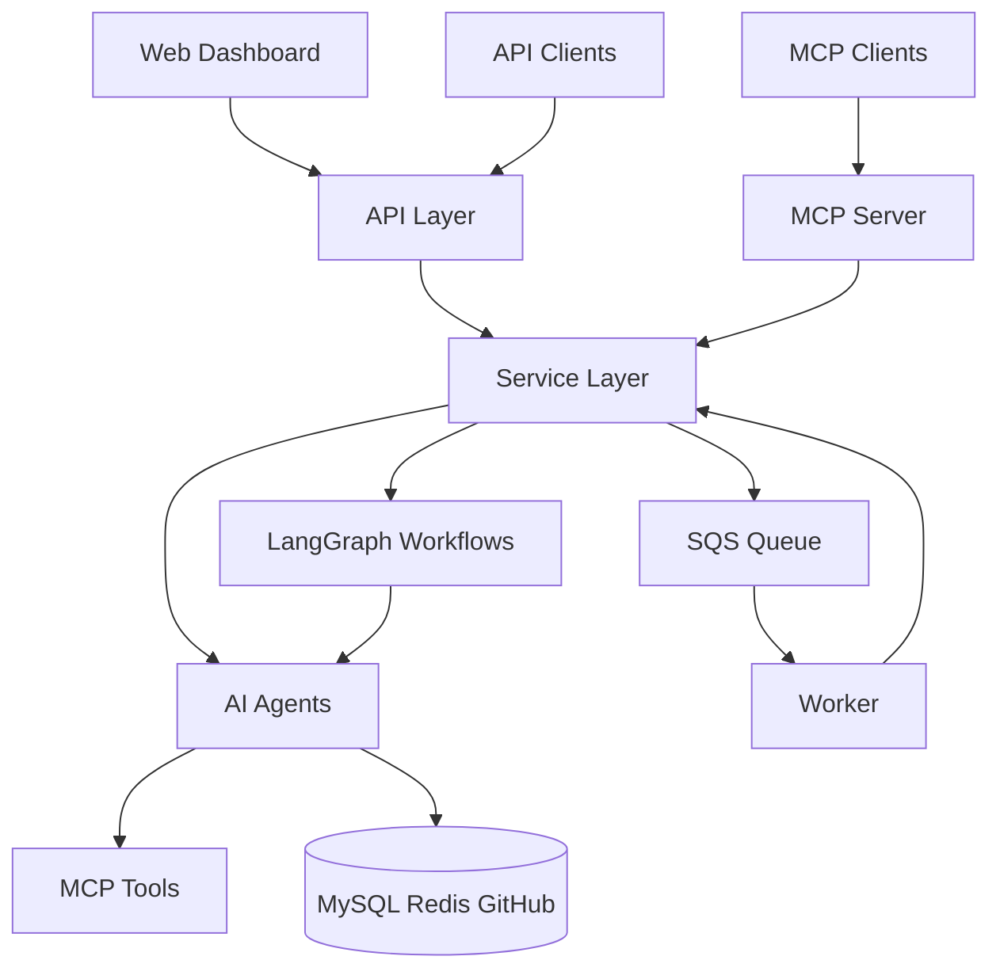

# SWE Agent Architecture

## System Overview



## Design Principles

### 1. Layer Isolation

Each layer has a single responsibility and can only communicate with adjacent layers:

- **API Layer** (`src/api/`): HTTP handling, request validation, dependency injection
- **Service Layer** (`src/services/`): Business logic, workflow orchestration
- **Repository Layer** (`src/repositories/`): Data access, query optimization
- **Provider Layer** (`src/providers/`): External service abstractions

### 2. Dependency Injection Pattern

Services declare dependencies in constructors; the DI container wires them:

```python
# Service declares what it needs
class AgentService:
    def __init__(self, repo: AgentRepository, github: GitHubProvider): ...

# DI container provides implementations
```

This enables testing with mocks without code changes.

### 3. Registry Pattern for Extensibility

The agents catalogue uses a registry pattern (`src/services/agents_catalogue/registry.py`) enabling:

- Dynamic service discovery at runtime
- Teams to add agents without modifying core code
- Versioning and routing by service name

### 4. Queue-Based Execution

Long-running agent tasks are queued for workers:

- API returns immediately with task ID
- Worker processes task asynchronously
- UI polls for status updates
- Enables horizontal scaling of workers

## Critical Data Flows

### Agent Execution Flow

1. Request hits `AgentsCatalogueRouter`
2. Router validates and calls `AgentsCatalogueService`
3. Service looks up agent in `ServiceRegistry`
4. Agent service creates LangGraph workflow
5. Workflow executes tools (MCPs) and AI agents
6. Results stored, task status updated

### Background Task Flow

1. Task created via API or event
2. `TaskService` submits to SQS via `QueueIntegration`
3. Worker polls SQS and receives message
4. Worker dispatches to appropriate handler
5. Handler executes and updates task status

## Key Technical Decisions

### Why LangGraph for Workflows?

LangGraph provides state machine semantics for agent execution:

- Explicit state management between steps
- Conditional branching based on tool results
- Error recovery and retry logic
- Observable execution paths

### Why Repository Pattern over Active Record?

Separates data access from business logic:

- Queries are centralized and optimizable
- Business logic doesn't leak SQL details
- Easy to swap data sources (test fakes, caching layers)

### Why Queue-Based vs Synchronous?

Agent tasks can run 5-30 minutes:

- HTTP timeouts would fail long tasks
- Worker scale-out handles load spikes
- Tasks survive API restarts

## Frontend Architecture

The React frontend (`ui/`) follows a clean separation:

- **Pages** (`src/pages/`): Route-level components, data fetching
- **Components** (`src/components/`): Reusable UI elements
- **Lib** (`src/lib/`): API clients, utilities

State management is local to components; server state is fetched via React Query.

## Configuration Strategy

Environment configuration uses TOML files with override hierarchy:

1. `env.default.toml` - Base settings
2. `env.{APP_ENV}.toml` - Environment overrides
3. `env.{APP_ENV}.local.toml` - Local developer overrides (git-ignored)
4. Environment variables - Production secrets

This enables developers to override settings without modifying tracked files.
